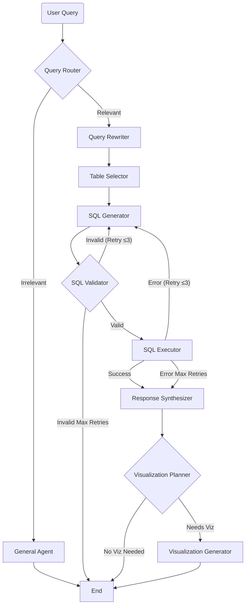

# Distribution Analytics AI Agent

An AI-powered application that lets non-technical users ask questions in plain English about a Global E-Commerce & Supply Chain database. The system translates natural language into SQL, executes it, returns answers in natural language, and renders interactive charts where appropriate.

## Features

- **Natural Language to SQL**: Converts complex user questions into precise SQLite queries.
- **Intelligent Query Rewriting**: Automatically refines vague queries ("show sales") into actionable requests.
- **Agentic Workflow**: Uses [LangGraph](https://langchain-ai.github.io/langgraph/) to orchestrate a team of specialized agents (Router, Table Selector, SQL Generator, Validator, Visualization Planner).
- **Interactive Visualizations**: Dynamically generates Vega-Lite charts when data suits visual representation.
- **Scope Guardrails**: A General Agent politely handles out-of-scope queries.
- **Real-time Streaming**: Server-Sent Events (SSE) stream the agent's reasoning steps and response tokens live.
- **Provider-Agnostic LLM**: Works with any OpenAI-compatible endpoint — OpenAI, Amazon Bedrock, Groq, etc.
- **Modern UI**: Polished, responsive React frontend with glassmorphism design.

## Architecture



## Dataset

The database covers a synthetic global e-commerce and supply chain operation with 8 related tables:

| Table | Rows | Description |
|-------|------|-------------|
| `customers` | ~8,000 | Registered customer accounts and demographics |
| `products` | ~500 | Master product catalog |
| `transactions` | ~100,000 | Line-item sales orders (central fact table) |
| `returns` | ~7,100 | Product returns tied to transactions |
| `inventory` | ~500 | Current warehouse stock per product |
| `price_history` | ~18,000 | Monthly pricing and sales snapshot per product |
| `supplier_costs` | ~1,000 | Supplier sourcing options per product |
| `marketing_spend` | ~216 | Monthly marketing performance per channel |

See [`context/data-card.md`](context/data-card.md) for full schema details and [`er-diagram.md`](er-diagram.md) for the entity-relationship diagram.

## Getting Started

### Prerequisites

- **Python** 3.11 or higher
- **Node.js** 18 or higher
- **uv** (recommended Python package manager) — [install](https://docs.astral.sh/uv/getting-started/installation/)
- **npm**
- An API key for any **OpenAI-compatible LLM endpoint**

### 1. Build the database

The SQLite database is generated from the CSV files in `data/` and is not committed to the repository. Run this once from the project root:

```bash
uv run python scripts/build_db.py
```

This creates `backend/app/data/ecommerce.db` (~20 MB) with proper column types and primary keys.

### 2. Backend setup

```bash
cd backend
uv sync
```

Create `backend/.env` from the template:

```bash
cp .env.example .env
```

Edit `backend/.env` and fill in your credentials:

```env
LLM_API_KEY=your_api_key_here
LLM_BASE_URL=
LLM_MODEL=gpt-4o
```

**Using Amazon Bedrock (mantle endpoint):**

```env
LLM_API_KEY=<your Bedrock API key>
LLM_BASE_URL=https://bedrock-mantle.us-east-1.api.aws/v1
LLM_MODEL=openai.gpt-oss-120b
```

> Any model that supports the `/v1/chat/completions` API will work. For Bedrock, use model IDs under the `openai.*` prefix (e.g. `openai.gpt-oss-120b`). Anthropic Claude models on Bedrock use the Messages API and are not compatible with Chat Completions.

### 3. Frontend setup

```bash
cd frontend
npm install
```

### Running the Application

Open two terminals:

**Terminal 1 — Backend:**

```bash
cd backend
./run_api.sh
```

The API starts at `http://localhost:8000`. Swagger docs at `http://localhost:8000/docs`.

**Terminal 2 — Frontend:**

```bash
cd frontend
npm run dev
```

The app is available at `http://localhost:5173`.

## Project Structure

```
nl2sql-agent/
├── data/                   # Source CSV files (8 tables)
├── context/
│   ├── data-card.md        # Full schema reference
│   └── project-overview.md # Project brief
├── er-diagram.md           # Entity-relationship diagram
├── scripts/
│   └── build_db.py         # One-time DB build script (CSV → SQLite)
├── SYSTEM_DESIGN.md        # Technical architecture
│
├── backend/                # FastAPI + LangGraph application
│   ├── app/
│   │   ├── agents/         # Agent nodes (router, sql_generator, etc.)
│   │   ├── graph/          # LangGraph workflow definition
│   │   ├── api/            # REST endpoints and SSE streaming
│   │   ├── services/       # LLM client and utilities
│   │   ├── tools/          # DB access and SQL validation
│   │   └── state/          # Shared AgentState definition
│   ├── .env.example        # Environment variable template
│   ├── run_api.sh          # Server launch script
│   └── pyproject.toml      # Python dependencies
│
└── frontend/               # React + Vite application
    ├── src/
    │   ├── components/     # ChatInterface, ThinkingProcess, VisualizationRenderer
    │   ├── hooks/          # useChat (SSE state management)
    │   └── types/          # TypeScript interfaces
    └── package.json
```

## Example Queries

- "What are the top 10 products by total revenue?"
- "Show monthly revenue trend for 2023 as a line chart."
- "Which customers have the highest return rate?"
- "What is the average discount percentage by product category?"
- "Which marketing channel has the best return on ad spend?"
- "Which products are below their reorder point in inventory?"
