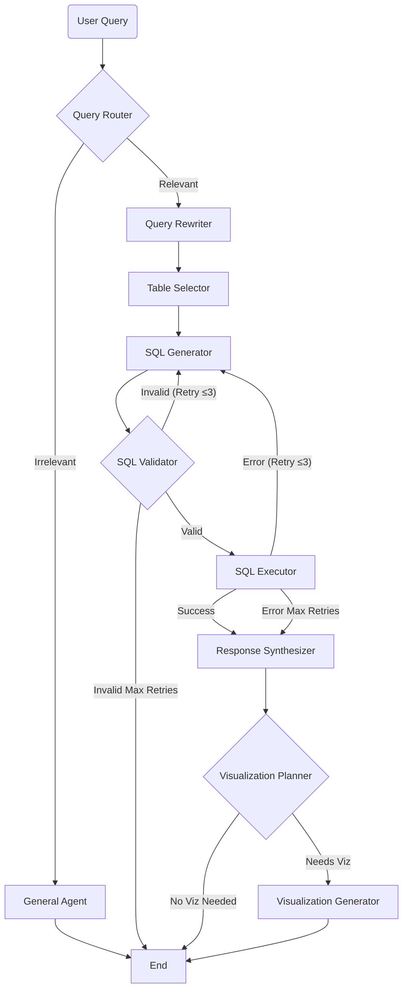

# E-commerce Supply Chain Analytics AI Agent

This application lets non-technical users ask questions in plain English about Global E-Commerce & Supply Chain database. The system translates natural language into SQL, executes it read-only, answers back in natural language, and renders interactive charts where the data suits one — streaming the agent's reasoning to the UI live via Server-Sent Events.

Under the hood it is an agentic workflow built with [LangGraph](https://langchain-ai.github.io/langgraph/): a team of specialized nodes (Router, Rewriter, Table Selector, SQL Generator, Validator, Executor, Response Synthesizer, and Visualization Planner/Generator) collaborate on each query. The LLM backend is model-agnostic — any endpoint exposing a Chat Completions API works via configuration alone.

## Quick Start (Agentic)

This project is designed to be set up by a coding agent. Paste the prompt below into your agent (Cursor, etc.), and it will read this file and run everything for you. Replace `<your OS>` with your platform (e.g. Windows / macOS / Linux).

```text
Read the @README.md, confirm you've read it, then install and run this project.
I'm on <your OS>. Build the database, set up the backend and the frontend,
create the backend .env from the template, and start both servers. Tell me
where to put my LLM API key and which URLs to open when they're running.
```

Prefer manual setup? See the [Project Setup](#project-setup) section below.

## Understanding the Database

The dataset is a synthetic **global e-commerce and supply chain operation**. It answers business questions across sales, customers, returns, inventory, pricing, supplier sourcing, and marketing performance.

| Table | Rows | Description |
|-------|------|-------------|
| `customers` | ~8,000 | Registered customer accounts and demographics (hub) |
| `products` | ~500 | Master product catalog (hub) |
| `transactions` | ~100,000 | Line-item sales orders (central fact table) |
| `returns` | ~7,100 | Product returns tied to transactions |
| `inventory` | ~500 | Current warehouse stock per product (1:1) |
| `price_history` | ~18,000 | Monthly pricing and sales snapshot per product |
| `supplier_costs` | ~1,000 | Supplier sourcing options per product |
| `marketing_spend` | ~216 | Monthly marketing performance per channel |

Full detail lives in [`data-schema-card.md`](data-schema-card.md) (column-level schema + ER diagram), [`context/data_dictionary.yaml`](context/data_dictionary.yaml) (LLM-facing semantics), and [`context/architecture.md`](context/architecture.md).

## Features

- **Natural Language to SQL** — converts plain-English questions into precise, read-only SQLite queries.
- **Intelligent Query Rewriting** — refines vague phrasing ("show sales") into clear, SQL-friendly requests.
- **Automatic Table Selection** — picks the minimal set of tables from the live schema plus data-dictionary semantics.
- **Self-Correcting SQL** — a retry loop (max 3) feeds validation and execution errors back to the model to fix its own SQL.
- **Interactive Visualizations** — generates Vega-Lite charts inline when the data benefits from a visual.
- **Scope Guardrails** — a General Agent politely handles out-of-scope and adversarial queries instead of running SQL.
- **Read-Only & SQL Safety** — read-only DB connection plus static SQL validation guarantee the database is never mutated.
- **Real-Time Streaming** — Server-Sent Events stream the agent's reasoning steps and answer tokens live.
- **Model-Agnostic LLM** — works with any Chat Completions endpoint (e.g. Amazon Bedrock), selected via configuration.
- **Offline Evaluation Harness** — scores the SQL generator against a golden dataset with a deterministic scorecard.
- **Modern UI** — polished, responsive React frontend with a glassmorphism-influenced design.

## Project Setup
### Prerequisites
- **Python** 3.11 or higher
- **Node.js** 18 or higher
- **uv** (Python package manager) — [install](https://docs.astral.sh/uv/getting-started/installation/)
- **npm**
- An API key for your chosen **LLM endpoint**

### 1. Clone the repository

```bash
git clone <repo-url> nl2sql-agent
cd nl2sql-agent
```

### 2. Build the database

The SQLite database is generated from the CSVs in `data/` and is **not** committed. Run once from the project root — this creates `backend/app/data/ecommerce.db` (~20 MB) with proper column types and primary keys:

```bash
uv run python scripts/build_db.py
```

### 3. Backend setup

```bash
cd backend
uv sync
```

Create the `.env` file from the template:

```bash
# macOS / Linux
cp .env.example .env
```

```powershell
# Windows PowerShell
Copy-Item .env.example .env
```

Then edit `backend/.env` and set your credentials (see [Configuration](#configuration)):

```env
LLM_API_KEY=your_api_key_here
LLM_BASE_URL=
LLM_MODEL=anthropic.claude-sonnet-4-6
```

### 4. Frontend setup

```bash
cd ../frontend
npm install
```

### 5. Run the application

Open two terminals.

**Terminal 1 — Backend** (starts at `http://localhost:8000`, Swagger docs at `/docs`):

```bash
# macOS / Linux
cd backend
./run_api.sh
```

```powershell
# Windows PowerShell (run_api.sh is bash-only; use this equivalent)
cd backend
$env:PYTHONPATH = $PWD
uv run uvicorn app.main:app --reload --port 8000
```

**Terminal 2 — Frontend** (app available at `http://localhost:5173`):

```bash
cd frontend
npm run dev
```

## Configuration

The LLM layer is model-agnostic. Set these in `backend/.env` (template: [`backend/.env.example`](backend/.env.example)):

| Variable | Description |
|----------|-------------|
| `LLM_API_KEY` | API key for your chosen LLM endpoint. |
| `LLM_BASE_URL` | Base URL selecting the provider. Leave empty for the OpenAI default. |
| `LLM_MODEL` | Model id served by that endpoint (default `anthropic.claude-sonnet-4-6`). |
| `EVAL_RAGAS` | Set to `1` to enable the optional RAGAS SQL-equivalence metric during evaluation. |

> Any endpoint exposing a Chat Completions API works — point `LLM_BASE_URL` at the provider (e.g. an Amazon Bedrock endpoint) and set `LLM_MODEL` to a model it serves. No code changes required.

## Architecture

Every question travels through a LangGraph state machine. Irrelevant/chitchat queries are answered by a General Agent and stop early; relevant queries flow through the full analytics pipeline, with a self-correction retry loop (max 3) around SQL generation.



- **Query Router** — decides whether the question is in-domain.
- **General Agent** — handles out-of-scope queries gracefully (streamed).
- **Query Rewriter** — refines vague phrasing into a clear request.
- **Table Selector** — picks the minimal tables from the live schema + data dictionary.
- **SQL Generator** — writes read-only SQLite; self-corrects on retry using the prior error.
- **SQL Validator** — regex-based safety gate (single `SELECT`/`WITH` only).
- **SQL Executor** — runs the query against the read-only connection.
- **Response Synthesizer** — turns the result set into a grounded NL answer (streamed).
- **Visualization Planner / Generator** — decides if a chart helps and produces a Vega-Lite spec.

For deeper detail see [`context/architecture.md`](context/architecture.md) and [`context/SYSTEM_DESIGN.md`](context/SYSTEM_DESIGN.md).

## Project Structure

```
nl2sql-agent/
├── data/                       # Source CSV files (8 tables)
├── context/
│   ├── project-overview.md     # Project brief
│   ├── architecture.md         # Technical architecture
│   ├── SYSTEM_DESIGN.md        # System design notes
│   └── data_dictionary.yaml    # LLM-facing semantics (descriptions, enums, relationships)
├── data-schema-card.md         # Full schema reference + ER diagram
├── scripts/
│   └── build_db.py             # One-time DB build (CSV → SQLite)
│
├── backend/                    # FastAPI + LangGraph application
│   ├── app/
│   │   ├── main.py             # FastAPI app, CORS, /health, router mount
│   │   ├── agents/             # LangGraph node logic (one node per file)
│   │   ├── graph/              # Workflow wiring, conditional edges, checkpointer
│   │   ├── api/                # /api/chat endpoint + SSE event generator
│   │   ├── services/           # LLM client + data-dictionary loader
│   │   ├── tools/              # DB access, schema strings, SQL validation
│   │   ├── state/              # Shared AgentState (TypedDict)
│   │   ├── observability/      # Structured JSON logging
│   │   ├── evaluation/         # Offline SQL-generator eval harness
│   │   └── data/ecommerce.db   # Built SQLite database (generated, not committed)
│   ├── evals/                  # Golden dataset + generated scorecards
│   ├── .env.example            # Environment variable template
│   ├── run_api.sh              # Server launch script
│   └── pyproject.toml          # Python dependencies
│
└── frontend/                   # React + Vite application
    └── src/
        ├── App.tsx             # Mounts ChatInterface
        ├── components/         # ChatInterface, ThinkingProcess, TraceMonitor, VisualizationRenderer
        ├── hooks/useChat.ts    # SSE connection + message/trace state
        └── types/index.ts      # Shared TypeScript interfaces
```

## Guardrails & Security

- **Read-only enforcement** — the database is opened via a read-only SQLite URI (`mode=ro`) with `PRAGMA query_only = ON` as defense in depth, so no statement can mutate data.
- **SQL-safety validation** — before execution, a query must be a single statement starting with `SELECT`/`WITH`; comments and string literals are stripped and forbidden keywords (`DROP`, `DELETE`, `UPDATE`, `INSERT`, `ALTER`, `PRAGMA`, …) are rejected.
- **Prompt-injection mitigation** — user text is wrapped as untrusted data with an instruction to ignore embedded directives before it reaches the SQL generator.
- **Scope routing** — the Query Router deflects off-domain and adversarial prompts to the General Agent instead of the SQL pipeline.

## Evaluation

An offline harness evaluates the SQL generator node in isolation over a small golden-SQL dataset in [`backend/evals/`](backend/evals/). It reports deterministic metrics (execution accuracy, safety rate, executability, exact-result match) as a JSON + markdown scorecard.

```bash
# From backend/ — deterministic run
uv run python -m app.evaluation.runner

# Mirror the graph's self-correction retry loop
uv run python -m app.evaluation.runner --self-correct
```

The optional RAGAS `LLMSQLEquivalence` semantic signal is flag-gated (never gates CI). Enable it with the eval extras and `EVAL_RAGAS=1`:

```bash
uv sync --extra eval
```

## Example Queries

- "What are the top 10 products by total revenue?"
- "Show monthly revenue trend for 2023 as a line chart."
- "Which customers have the highest return rate?"
- "What is the average discount percentage by product category?"
- "Which marketing channel has the best return on ad spend?"
- "Which products are below their reorder point in inventory?"
