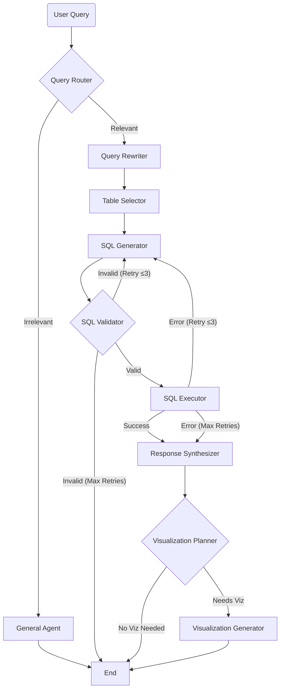

# SQL Agent Backend

Backend for the Distribution Analytics AI Agent System.

## Architecture

This application uses a graph-based agent architecture orchestrated by [LangGraph](https://langchain-ai.github.io/langgraph/). The system processes natural language queries, converts them to SQL, executes them against a SQLite database, and optionally generates visualizations.

### Agent Workflow



### Components

1.  **Query Router**: Determines if the user's query is relevant to the domain (Global E-Commerce & Supply Chain analytics).
2.  **Query Rewriter**: Refines vague user queries into specific, unambiguous questions (e.g., "sales" -> "total sales revenue by year").
3.  **Table Selector**: Identifies the relevant database tables from the schema to reduce context window usage.
4.  **SQL Generator**: Generates a valid SQLite query based on the selected schema and refined question.
5.  **SQL Validator**: Checks the generated SQL for safety (e.g., no DROP/DELETE) and syntax errors.
6.  **SQL Executor**: Runs the query against the `ecommerce.db` SQLite database.
7.  **Response Synthesizer**: Converts the database results into a natural language answer.
8.  **Visualization Planner**: Analyzes the data to determine if a chart is appropriate and selects a chart type (bar/line/pie/scatter).
9.  **Visualization Generator**: Creates a Vega-Lite v6 JSON specification, grounded in curated v6 few-shot examples. The result data and the v6 `$schema` are injected server-side (not round-tripped through the LLM).
10. **General Agent**: Handles out-of-scope queries with helpful guidance.

## Setup

### Prerequisites

- Python 3.10+
- `uv` package manager (recommended) or `pip`

### Installation

1.  Clone the repository.
2.  Navigate to the `backend` directory.
3.  Install dependencies:

    ```bash
    uv sync
    # OR
    pip install -r requirements.txt
    ```

4.  Set up environment variables:
    Create a `.env` file in the `backend` directory (see `.env.example`) and configure your model-agnostic LLM credentials:

    ```env
    LLM_API_KEY=your_api_key_here
    LLM_BASE_URL=
    LLM_MODEL=<a model id served by the endpoint>
    ```

### Running the Server

Use the provided shell script to start the FastAPI server:

```bash
./run_api.sh
```

The API will be available at `http://localhost:8000`.
API documentation is available at `http://localhost:8000/docs`.

### Database

 The application uses a SQLite database (`ecommerce.db`) located in `app/data/`, built from the CSVs in the repo-root `data/` folder via `python scripts/build_db.py`.

## Evaluation (SQL Generator)

An offline harness evaluates the **SQL Generator** node in isolation. It runs the node directly (bypassing the graph) over a golden dataset and scores the generated SQL deterministically. See `app/evaluation/` and `evals/`.

### What it measures

Deterministic metrics (these gate CI):

- **Execution accuracy** (anchor): executes both the generated and the reference (`golden_sql`) query read-only and compares result sets as an order-insensitive, float-tolerant multiset (column aliases are ignored). Cases flagged `order_sensitive` (e.g. top-N) are compared in order.
- **Safety rate**: fraction passing `validate_sql_safety` (read-only SELECT/WITH, single statement, no forbidden keywords).
- **Executability rate**: fraction that run without a SQLite error.
- **Exact result match**: supplementary diagnostic.

Optional, **non-gating** signal:

- **RAGAS `LLMSQLEquivalence`**: an LLM judgment of whether the generated SQL is semantically equivalent to the reference, useful for explaining execution-accuracy mismatches. Off by default; reported but never asserted.

### Dataset

`evals/golden_sql.jsonl` holds 15 seed cases spanning filters, aggregates, GROUP BY, top-N ordering, single/multi-table joins, date filters, monthly time-series, DISTINCT, multi-condition WHERE, CTEs/subqueries, HAVING, boolean-flag and enum filters, and a computed cross-join ratio. Each case supplies `selected_tables` and `refined_query` as fixtures so generation is isolated from upstream nodes.

### Running

```bash
# Generate a scorecard (writes evals/scorecard.json and evals/scorecard.md)
uv run python -m app.evaluation.runner

# Also exercise the validator/executor self-correction retry loop
uv run python -m app.evaluation.runner --self-correct

# Validate just the golden dataset (no LLM calls)
uv run python -m app.evaluation.dataset
```

The scorecard reports overall metrics, a per-category breakdown, and a per-case table (with the generated SQL and failure notes) for debugging. A case that fails `execution_match` but passes safety/executability points at a correctness gap; a failure to execute points at a syntax/semantic bug in generation.

### CI gate (pytest)

```bash
uv run pytest evals/test_evals.py -v
```

- Offline tests (dataset integrity + metric logic) always run.
- The end-to-end threshold tests (execution accuracy >= `EVAL_EXEC_THRESHOLD`, default 0.80; safety rate == 1.0) invoke the LLM and are **auto-skipped** when `LLM_API_KEY` is unset.

### Optional RAGAS layer

RAGAS is opt-in and reuses the existing `LLM_*` configuration (LLM-only, no embeddings). Its dependencies are declared as an optional extra and imported lazily, so the core app and the deterministic eval never require them.

```bash
uv sync --extra eval      # install ragas + langchain-openai + pytest
EVAL_RAGAS=1 uv run python -m app.evaluation.runner
```
