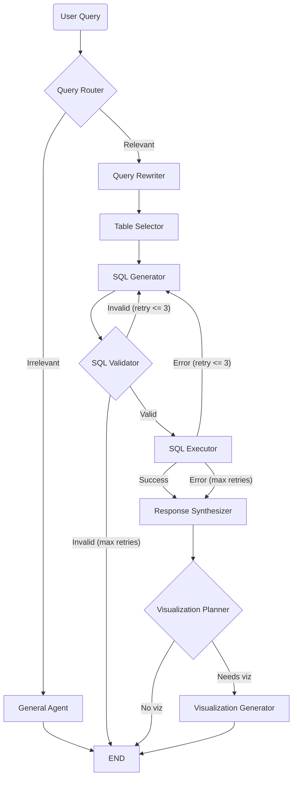

# Architecture

An intelligent SQL analytics agent that converts natural-language questions into SQL, executes them read-only against a Global E-Commerce & Supply Chain database, and returns natural-language answers with optional Vega-Lite charts. Agent reasoning steps and answer tokens stream to the UI live via Server-Sent Events.

---

## Stack

| Layer | Tool | Purpose |
| ----- | ---- | ------- |
| API framework | FastAPI | HTTP API + SSE streaming endpoint |
| ASGI server | Uvicorn | Serves the FastAPI app |
| Agent orchestration | LangGraph | State-machine workflow of specialized agent nodes |
| LLM client | OpenAI SDK (`AsyncOpenAI`) | Model-agnostic Chat Completions calls |
| LLM provider | Any Chat Completions endpoint (e.g. Amazon Bedrock) | Selected via `LLM_BASE_URL` / `LLM_MODEL` |
| Database | SQLite (`sqlite3`) | Read-only analytics store |
| DB build | pandas | Loads CSVs into typed SQLite tables |
| Config | python-dotenv | Loads `LLM_*` settings from `.env` |
| Language (backend) | Python 3.11+ | Throughout |
| Frontend framework | React 19 + TypeScript | Single-page chat UI |
| Build tool | Vite 7 | Dev server and bundler |
| Styling | Tailwind CSS v4 | UI styling |
| Visualization | Vega-Lite v6 + vega-embed | Renders agent-generated chart specs |
| Icons | Lucide React | UI icons |
| Transport | Server-Sent Events (SSE) | Streams `updates` + `custom` events to the browser |
| Evaluation (optional) | RAGAS + langchain-openai + pytest | Flag-gated SQL-equivalence scoring + tests |

The LLM layer is model-agnostic: any endpoint exposing a Chat Completions API works by setting `LLM_API_KEY`, `LLM_BASE_URL`, and `LLM_MODEL` — no code changes.

---

## Folder Structure

```
nl2sql-agent/
├── data/                       → Source CSV files (8 tables)
├── context/
│   ├── project-overview.md     → Project brief
│   ├── architecture.md         → This document
│   └── data_dictionary.yaml    → LLM-facing semantics (descriptions, enums, relationships)
├── data-schema-card.md         → Full schema reference + ER diagram
├── scripts/
│   └── build_db.py             → One-time DB build (CSV → SQLite)
│
├── backend/                    → FastAPI + LangGraph application
│   ├── app/
│   │   ├── main.py             → FastAPI app, CORS, /health, router mount
│   │   ├── agents/             → LangGraph node logic (one node per file)
│   │   │   ├── router.py           → Relevance routing
│   │   │   ├── rewriter.py         → Query refinement
│   │   │   ├── general.py          → Out-of-scope handler (streamed)
│   │   │   ├── table_selector.py   → Table selection
│   │   │   ├── sql_generator.py    → SQL generation + self-correction
│   │   │   ├── validator.py        → SQL safety gate
│   │   │   ├── executor.py         → Read-only execution
│   │   │   ├── synthesizer.py      → NL answer (streamed)
│   │   │   └── visualization.py    → Viz planner + generator
│   │   ├── graph/graph.py      → Workflow wiring, conditional edges, checkpointer
│   │   ├── api/routes.py       → /api/chat endpoint + SSE event generator
│   │   ├── services/           → LLM client + data-dictionary loader
│   │   ├── tools/              → DB access, schema strings, SQL validation
│   │   ├── state/state.py      → Shared AgentState (TypedDict)
│   │   ├── observability/      → Structured JSON logging
│   │   ├── evaluation/         → Offline SQL-generator eval harness
│   │   └── data/ecommerce.db   → Built SQLite database (generated, not committed)
│   ├── evals/                  → Golden dataset + generated scorecards
│   ├── .env.example            → Environment variable template
│   ├── run_api.sh              → Server launch script
│   └── pyproject.toml          → Python dependencies
│
└── frontend/                   → React + Vite application
    └── src/
        ├── App.tsx             → Mounts ChatInterface
        ├── components/         → ChatInterface, ThinkingProcess, TraceMonitor, VisualizationRenderer
        ├── hooks/useChat.ts    → SSE connection + message/trace state
        ├── lib/utils.ts        → Shared UI utilities (cn)
        └── types/index.ts      → Shared TypeScript interfaces
```

---

## System Boundaries

| Folder | Owns |
| ------ | ---- |
| `backend/app/agents/` | LangGraph node logic — one node per file. Nodes call `services/` and `tools/`; they never open DB connections directly or contain FastAPI code. |
| `backend/app/graph/` | Workflow definition: node registration, conditional edges, retry routing, and the `MemorySaver` checkpointer. |
| `backend/app/api/` | FastAPI routes and the SSE event generator only. No agent logic — it just drives `app_graph.astream`. |
| `backend/app/services/` | LLM client construction and the data-dictionary loader. Provider selection lives here. |
| `backend/app/tools/` | All database access, schema-string building, and SQL safety validation. The only place that touches SQLite. |
| `backend/app/state/` | The shared `AgentState` TypedDict passed between nodes. |
| `backend/app/observability/` | Structured JSON logging setup. |
| `backend/app/evaluation/` | Offline SQL-generator eval harness — dataset, metrics, runner, report. Imports app code but the app never imports it. |
| `frontend/src/components/` | UI only. No direct API/fetch logic beyond what the hook provides. |
| `frontend/src/hooks/` | SSE connection and message/trace state (`useChat`). |
| `frontend/src/types/` | Shared TypeScript interfaces. |

---

## Data Flow

### Query Lifecycle (Agent Graph)

Irrelevant/chitchat queries are answered by the General Agent and stop early. Relevant queries flow through the full analytics pipeline, with a self-correction retry loop (max 3) around SQL generation.



### SSE Streaming Flow

```
POST /api/chat { message, thread_id }
        ↓
event_generator() calls app_graph.astream(inputs, config, stream_mode=["updates", "custom"])
        ↓
mode == "updates"  → per-node state changes → SSE events:
                       node_update, sql, data, visualization, error, response
mode == "custom"   → token chunks (get_stream_writer) → SSE token events
        ↓
Frontend useChat reads the ReadableStream, splits on "\n\n", parses each "data: {...}"
        ↓
token events append to the assistant message; node_update/sql/data feed the ThinkingProcess timeline;
visualization sets the message's Vega-Lite spec
```

### Database Build Flow

```
data/*.csv  (8 source tables)
        ↓
scripts/build_db.py  → explicit typed CREATE TABLE + primary keys, bool → 0/1 coercion (pandas)
        ↓
backend/app/data/ecommerce.db  (SQLite, ~20 MB, generated, not committed)
```

---

## Database

SQLite, opened **read-only** by the agent. Built from the CSVs in `data/` via [scripts/build_db.py](scripts/build_db.py) with explicit, primary-key-aware `CREATE TABLE` statements so schema introspection (`sqlite_master`) reflects real column types and keys.

| Table | Rows | Description |
| ----- | ---- | ----------- |
| `customers` | ~8,000 | Registered customer accounts and demographics (hub) |
| `products` | ~500 | Master product catalog (hub) |
| `transactions` | ~100,000 | Line-item sales orders (central fact table) |
| `returns` | ~7,100 | Product returns tied to transactions |
| `inventory` | ~500 | Current warehouse stock per product (1:1) |
| `price_history` | ~18,000 | Monthly pricing and sales snapshot per product |
| `supplier_costs` | ~1,000 | Supplier sourcing options per product |
| `marketing_spend` | ~216 | Monthly marketing performance per channel |

- **Source-of-truth split:** structural facts (real table/column names and types) are read live from the database; semantics (descriptions, enums, relationships, query notes) live in [context/data_dictionary.yaml](context/data_dictionary.yaml). At prompt time, `get_schema_context()` merges the live DDL with the dictionary.
- **Hubs & joins:** `products` and `customers` are the central entities; analysis flows through `transactions`. `marketing_spend` links softly to `transactions` on `channel` (no foreign key).
- Full column-level detail and the ER diagram are in [data-schema-card.md](data-schema-card.md).

---

## Session & State Management

- **No authentication.** The app is a single-page chat UI with no login or protected routes.
- **Thread identity:** the frontend generates a UUID once and stores it in `localStorage` (`sql_agent_session_id`), then sends it as `thread_id` on every `/api/chat` request ([frontend/src/hooks/useChat.ts](frontend/src/hooks/useChat.ts)).
- **Conversation state:** LangGraph isolates state per `thread_id` using an in-memory `MemorySaver` checkpointer ([backend/app/graph/graph.py](backend/app/graph/graph.py)). State is not persisted — it is lost on server restart.
- **CORS:** permissive (`allow_origins=["*"]`) for local development ([backend/app/main.py](backend/app/main.py)); restrict for any real deployment.

---

## LLM Client Pattern

Model-agnostic client built once and cached. `LLM_BASE_URL` selects the provider; `LLM_MODEL` selects the model ([backend/app/services/llm.py](backend/app/services/llm.py)).

```python
from openai import AsyncOpenAI

def get_llm_client() -> AsyncOpenAI:
    api_key = os.getenv("LLM_API_KEY")
    base_url = os.getenv("LLM_BASE_URL") or None  # None => provider default
    return AsyncOpenAI(api_key=api_key, base_url=base_url)

def get_model() -> str:
    return os.getenv("LLM_MODEL", "gpt-4o")
```

```env
# backend/.env
LLM_API_KEY=your_api_key_here
LLM_BASE_URL=
LLM_MODEL=anthropic.claude-sonnet-4-6
```

JSON-output nodes (router, table selector, viz planner/generator) parse responses with `parse_json_response()`, which tolerates markdown fences and surrounding prose.

---

## SQL Safety & Read-Only Pattern

Two independent layers guarantee the database is never mutated.

**1. Read-only connection** ([backend/app/tools/sql.py](backend/app/tools/sql.py)):

```python
uri = f"file:{DB_PATH}?mode=ro"          # read-only at the OS/driver level
conn = sqlite3.connect(uri, uri=True)
conn.row_factory = sqlite3.Row
conn.execute("PRAGMA query_only = ON;")  # defense in depth
```

**2. Static safety validation before execution** ([backend/app/tools/validator.py](backend/app/tools/validator.py)):

- Strips comments and string literals so keywords cannot be hidden.
- Requires a single statement starting with `SELECT` or `WITH` (leading parens allowed for `(SELECT ...) UNION ALL (SELECT ...)`).
- Rejects forbidden keywords: `DROP`, `DELETE`, `TRUNCATE`, `UPDATE`, `INSERT`, `ALTER`, `GRANT`, `REVOKE`, `ATTACH`, `DETACH`, `PRAGMA`, `CREATE`, `VACUUM`, `REINDEX`.

Prompt injection is mitigated by wrapping the user question as untrusted data via `wrap_user_input()` before it reaches the SQL generator.

---

## SSE Streaming Pattern

Agent nodes emit token chunks through LangGraph's stream writer; the API forwards both stream modes as SSE.

```python
# Inside a node (e.g. synthesizer.py / general.py)
from langgraph.config import get_stream_writer

writer = get_stream_writer()
stream = await client.chat.completions.create(model=get_model(), messages=messages, stream=True)
async for chunk in stream:
    content = chunk.choices[0].delta.content
    if content:
        writer(content)          # emitted on the "custom" stream
        full_response += content
```

```python
# API consumption (routes.py)
async for mode, payload in app_graph.astream(inputs, config=config,
                                             stream_mode=["updates", "custom"]):
    if mode == "updates":        # per-node state changes → node_update/sql/data/visualization/error
        ...
    elif mode == "custom":       # token chunks → {"type": "token", "content": payload}
        ...
```

---

## Schema Grounding Pattern

The SQL generator is grounded in real, current schema — never a hardcoded copy ([backend/app/services/data_dictionary.py](backend/app/services/data_dictionary.py)).

- `get_schema_context(tables)` builds, per selected table: the live `CREATE TABLE` DDL (from `sqlite_master`) + the dictionary's description, column meanings, and enum values, followed by cross-table relationships and global query notes.
- The table selector filters the LLM's chosen tables against the live `get_table_names()` list, discarding any hallucinated names before SQL generation.

Note: the visualization generator uses a single grounded prompt that inlines the result data and a fixed pastel Vega-Lite `config` ([backend/app/agents/visualization.py](backend/app/agents/visualization.py)); it does not currently use few-shot examples or inject a `$schema`.

---

## Invariants

Rules the system must never violate:

- Agents never open database connections directly — all DB access goes through `backend/app/tools/`.
- Every generated query passes `validate_sql_safety()` before it is executed. Unsafe SQL is never run.
- The database is only ever opened read-only (`mode=ro` + `PRAGMA query_only`). No write/DML/DDL path exists.
- Only a single `SELECT`/`WITH` statement executes per query — no statement chaining.
- User input is always wrapped as untrusted data (`wrap_user_input`) before reaching the SQL generator.
- The LLM layer stays model-agnostic — no provider is hardcoded; selection is via `LLM_*` env vars only.
- Selected table names are validated against the live schema — hallucinated tables are dropped.
- The generation/validation/execution retry loop is capped at 3 attempts before falling back to an error response.
- `api/` contains no agent logic and `agents/` contains no HTTP/route logic.
