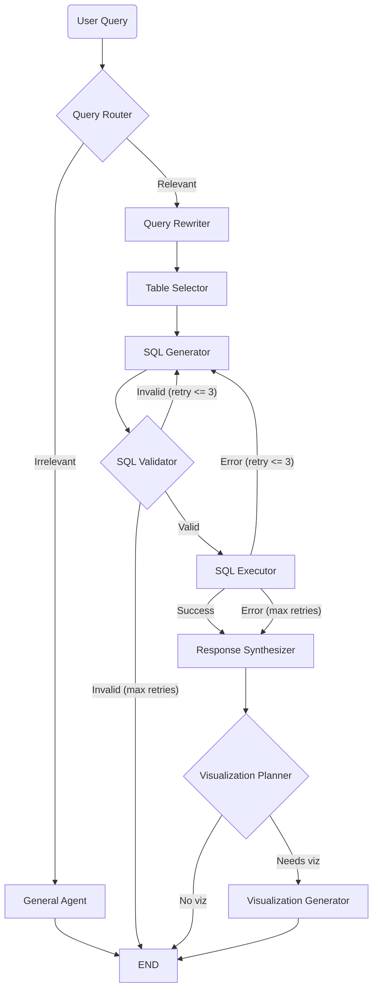

# Project Overview

## About the Project

The Distribution Analytics AI Agent is a natural-language interface to a Global E-Commerce & Supply Chain database. A non-technical user asks a question in plain English ("which marketing channel has the best return on ad spend?"), and the agent translates it into SQL, executes it read-only against a SQLite database, answers back in natural language, and renders an interactive chart when the data suits one.

Under the hood it is an agentic workflow built with [LangGraph](https://langchain-ai.github.io/langgraph/): a team of specialized nodes (Router, Rewriter, Table Selector, SQL Generator, Validator, Executor, Response Synthesizer, and Visualization Planner/Generator) collaborate on each query. The agent's reasoning steps and answer tokens stream to the UI live via Server-Sent Events, so the user watches the agent think in real time. The LLM backend is model-agnostic — any endpoint exposing a Chat Completions API (e.g. Amazon Bedrock) works via configuration alone.

---

## The Problem It Solves

Most business and operations data lives behind SQL, which the people who most need answers usually cannot write. Getting a number often means filing a request and waiting on an analyst.

This agent removes that barrier. It exposes an 8-table, join-heavy dataset through plain conversation — resolving vague phrasing, picking the right tables, writing and self-correcting the SQL, and summarizing the result in words plus a chart. The agent's reasoning is visible at every step, and hard safety guardrails keep the database read-only, so users get trustworthy answers without touching SQL.

---

## Knowledge to Test

- Engineering & UX: schema handling, chart-type selection, latency
- Eval: SQL correctness, answer groundedness, ambiguous query handling
- Guardrails & security: SQL injection, prompt injection, read-only enforcement, destructive queries

---

## Interface & UX

A single-page React chat application — no authentication, no multi-page navigation. The whole product is one conversation surface, branded "E-Commerce Analyst / Contango Agent".

- **Header** — app title and a live status indicator.
- **Message list** — user and assistant turns, with assistant answers streamed token-by-token.
- **Thinking Process** — a live timeline of agent steps (routing, table selection, SQL generation, validation, execution, synthesis, visualization) with icons and status, including the generated SQL and intermediate results.
- **Inline visualizations** — Vega-Lite charts rendered directly in the assistant's response when the data benefits from one.
- **Empty state** — a friendly prompt with example questions to get the user started.

Styling is Tailwind CSS with a polished, responsive, glassmorphism-influenced design.

---

## Core User Flow (Query Lifecycle)

Every question travels through a LangGraph state machine. Irrelevant/chitchat queries are answered politely by a General Agent and stop early; relevant queries flow through the full analytics pipeline, with a self-correction retry loop (max 3) around SQL generation.

1. **Query Router** — decides whether the question is relevant to the e-commerce/supply-chain domain.
2. **General Agent** — for out-of-scope queries, replies helpfully and suggests in-scope questions (streamed).
3. **Query Rewriter** — refines vague phrasing into a clear, SQL-friendly request.
4. **Table Selector** — picks the minimal set of tables needed, from the live schema plus data-dictionary descriptions.
5. **SQL Generator** — writes read-only SQLite; on retry it consumes the prior validation or execution error to self-correct.
6. **SQL Validator** — regex-based safety check (SELECT/WITH only, single statement, forbidden keywords blocked).
7. **SQL Executor** — runs the query against the read-only SQLite connection.
8. **Response Synthesizer** — turns the result set into a concise natural-language answer (streamed token-by-token).
9. **Visualization Planner / Generator** — decides if a chart helps and, if so, produces a Vega-Lite specification.

Conversation state is isolated per `thread_id` via an in-memory LangGraph `MemorySaver` (lost on restart).

---

## Data Architecture

A synthetic Global E-Commerce & Supply Chain database with 8 related tables, built from CSVs into SQLite via `scripts/build_db.py`. The database is **read-only** for the agent — no table has update-in-place semantics.

| Table | Rows | Description |
|-------|------|-------------|
| `customers` | ~8,000 | Registered customer accounts and demographics (hub) |
| `products` | ~500 | Master product catalog (hub) |
| `transactions` | ~100,000 | Line-item sales orders (central fact table) |
| `returns` | ~7,100 | Product returns tied to transactions |
| `inventory` | ~500 | Current warehouse stock per product (1:1) |
| `price_history` | ~18,000 | Monthly pricing and sales snapshot per product |
| `supplier_costs` | ~1,000 | Supplier sourcing options per product |
| `marketing_spend` | ~216 | Monthly marketing performance per channel |

- **Hubs & joins:** `products` and `customers` are the central entities; most analysis flows through `transactions` as the fact table. `marketing_spend` links softly to `transactions` on the shared `channel` value (no hard foreign key).
- **Source of truth split:** structural facts (real table/column names and types) are read live from the database; semantics (descriptions, enums, relationships, query notes) live in [context/data_dictionary.yaml](context/data_dictionary.yaml). Full schema detail is in [data-schema-card.md](data-schema-card.md).

---

## Features In Scope

- Natural-language to SQL translation over an 8-table joined dataset
- Intelligent query rewriting to resolve vague/ambiguous phrasing
- Automatic table selection from the live schema + data dictionary
- SQL generation with a self-correction retry loop (max 3) that feeds errors back to the model
- Read-only SQL execution against SQLite
- Natural-language response synthesis grounded in the query result
- Chart-type planning and Vega-Lite visualization generation
- Scope guardrail — a General Agent that gracefully handles out-of-scope queries
- Real-time SSE streaming of both agent reasoning steps and answer tokens
- Security guardrails — read-only enforcement, SQL-safety validation, and prompt-injection input wrapping
- Offline evaluation harness for the SQL generator (golden dataset + deterministic scorecard)
- Model-agnostic LLM backend (configurable API key, base URL, and model)

---

## Features Out of Scope

- Authentication, user accounts, or multi-user/team support
- Production deployment and hosting
- Any write/DML operations against the database (insert, update, delete, DDL)
- Multiple or user-supplied databases — one fixed dataset only
- Persistent conversation history (state is in-memory, lost on restart)
- Mobile app or browser extension
- Data ingestion/ETL UI — the database is pre-built from CSVs via a script
- Scheduled or automated report generation
- Payment or subscription system

---

## Guardrails & Security

- **Read-only enforcement** — the database is opened via a read-only SQLite URI (`mode=ro`) with `PRAGMA query_only = ON` as defense in depth ([backend/app/tools/sql.py](backend/app/tools/sql.py)), so no statement can mutate data regardless of the SQL passed in.
- **SQL-safety validation** — before execution, queries must be a single statement starting with `SELECT`/`WITH`, with comments and string literals stripped and a forbidden-keyword scan (`DROP`, `DELETE`, `UPDATE`, `INSERT`, `ALTER`, `PRAGMA`, etc.) ([backend/app/tools/validator.py](backend/app/tools/validator.py)).
- **Prompt-injection mitigation** — user text is fenced as untrusted data with an explicit instruction to ignore embedded directives via `wrap_user_input` ([backend/app/services/llm.py](backend/app/services/llm.py)).
- **Scope routing** — the Query Router deflects off-domain and adversarial prompts to the General Agent instead of the SQL pipeline.

---

## Evaluation

An offline harness ([backend/app/evaluation/](backend/app/evaluation/)) evaluates the SQL generator node in isolation over a small golden-SQL dataset ([backend/evals/golden_sql.jsonl](backend/evals/golden_sql.jsonl)).

- **Deterministic metrics** (the anchor): execution accuracy (result sets compared, not SQL text), safety rate, executability rate, and exact-result match — rolled up overall and per SQL category into a JSON + markdown scorecard.
- **Self-correction mode** — optionally mirrors the graph's validator/executor retry loop and reports recovery rate and average attempts.
- **RAGAS `LLMSQLEquivalence`** — an optional, flag-gated semantic-equivalence signal that never gates CI.

---

## Target User

A non-technical business, operations, or supply-chain analyst who needs answers from the data but does not write SQL. They are comfortable with a modern web app, think in business questions rather than table joins, and want a fast, trustworthy answer — ideally with a chart — plus enough visible reasoning to trust the result.

---

## Success Criteria

- The agent produces correct SQL that returns the right answer for a range of single-table and multi-join questions.
- Natural-language answers are grounded in the query results — no fabricated numbers.
- Chart-type selection is sensible, and generated Vega-Lite specs render cleanly in the UI.
- Ambiguous questions are reasonably disambiguated; out-of-scope questions are handled gracefully by the General Agent.
- Read-only safety holds — destructive or injection attempts are blocked, never executed.
- Streaming keeps perceived latency low; the user sees reasoning and tokens as they happen.
- The evaluation scorecard shows strong execution accuracy and a 100% safety rate on the golden set.
