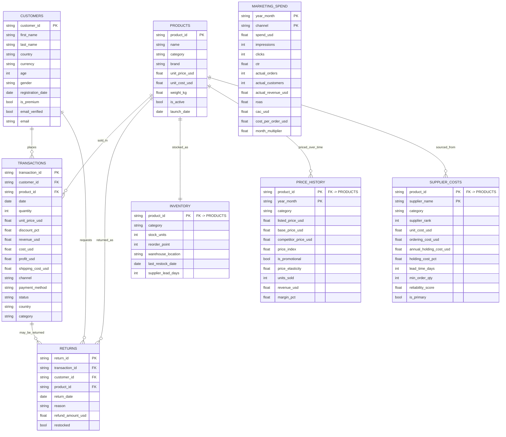

# ER Diagram — Global E-Commerce & Supply Chain Database

Entity-relationship diagram for the 8 interconnected tables. Crow's-foot notation
(`||` = exactly one, `o{` = zero-or-many). Primary keys are marked `PK`, foreign
keys `FK`.

> Note: `MARKETING_SPEND` has no hard foreign key. It relates to `TRANSACTIONS`
> softly via the shared `channel` value (and to `PRICE_HISTORY`/time-based tables
> via `year_month`), so it is shown standalone.
